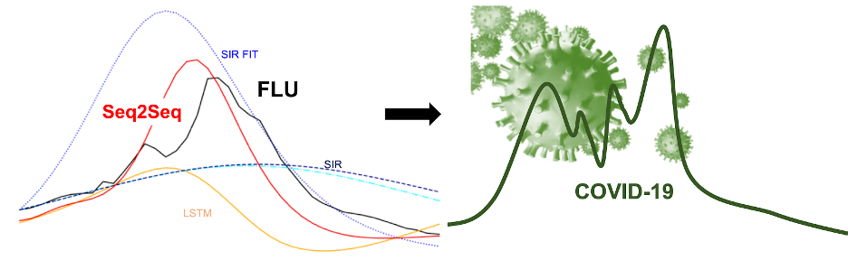

# This repository contains the code related to the blog post by Erin Stafford and Eli Shlizerman:
# Which models to use for epidemic prediction?
** Comparison of Data-Driven and Model-Based Methods for Prediction of Influenza and COVID-19 Cases**

**Co-authors: Erin Stafford, Eli Shlizerman**

In the time of COVID-19, the need for accurate predictions of both long-term and short-term evolution of epidemics has been made apparent. In order to determine which methods may be the most useful in making epidemic prediction, we propose to compare traditional model-based methods, such as Susceptible Infected Recovered model (SIR), with emerging data-driven based models including recurrent neural networks (RNN) for time series prediction. We propose to compare these different methods on influenza (flu) data which is more robust, and then examine applications to COVID-19. Our study shows the promise and generality of data-driven methods for both influenza and COVID-19, in particular, our study identifies the Seq2Seq neural network, previously demonstrated as an effective method in sequence prediction and clustering [1,2], as a promising approach for epidemic prediction.

